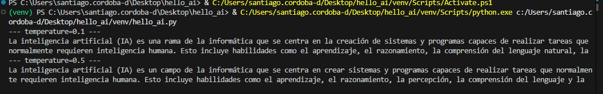
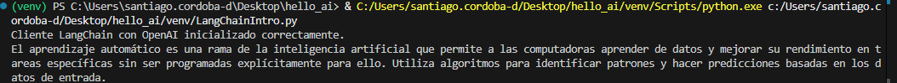
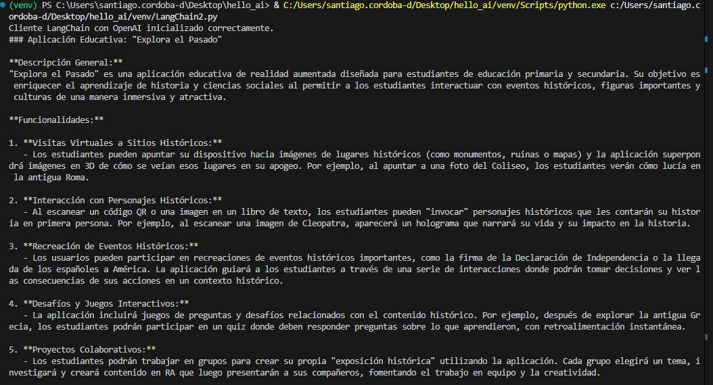
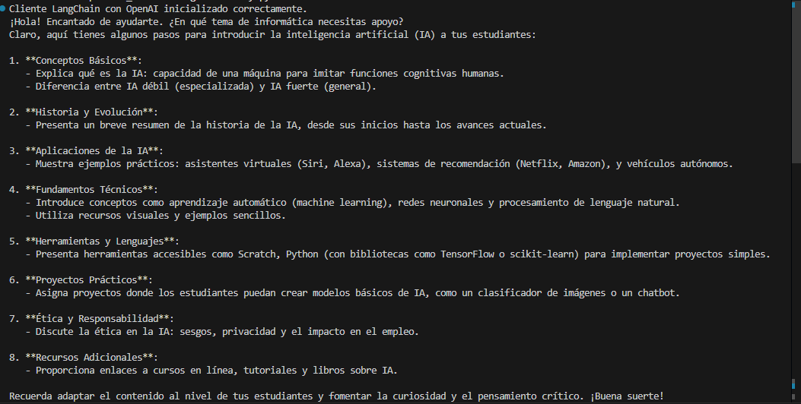

# Basic-LangChainLlm (Trabajo en Clase)
Este proyecto demuestra cómo integrar la **API de OpenAI** y **LangChain** en Python para realizar tareas de lenguaje natural: desde simples consultas a modelos hasta cadenas de procesamiento más complejas con memoria conversacional.

Se usan ejemplos con el modelo **`gpt-4o-mini`**, ideal para experimentos educativos y prototipos ligeros.

##  Introducción

El proyecto contiene varios ejemplos prácticos de cómo:

1. **Conectarse a la API de OpenAI** usando variables de entorno seguras (`.env`).
2. **Usar LangChain** para construir cadenas de prompts y procesar las respuestas.
3. **Encadenar pasos** (por ejemplo, definir un concepto y luego crear una aplicación educativa de ese concepto).
4. **Mantener memoria conversacional** con LangChain.

##  Requisitos previos

Asegúrate de tener instalado:

- Python 3.10 o superior
- Una cuenta y **clave de API de OpenAI**
- Git (para clonar el repositorio)

##  Instalación

1. **Clonar este repositorio:**
   ```bash
   git clone https://github.com/Santiago-Cordoba/Basic-LangChainLlm.git
   ``` 
2. **Instalar las dependencias**
    ```
    pip install -U openai python-dotenv langchain langchain-openai
    ```
   
3. **Crear el archivo .env y poner en este la llave de la API**
    ```
   # .env
    OPENAI_API_KEY=sk-XXXXXXXXXXXXXXXXXXXXXXXXXXXX

    ```
   
## Ejemplos con el debido funcionamiento

### Introduccion

En este ejercicio se hace una conexión a la IA y se le envia un prompt sencillo para recibir la respuesta y probar su funcionamiento de manera basica.
``` bash
import os
from openai import OpenAI
from dotenv import load_dotenv
# Cargar variables de entorno
load_dotenv()
# Inicializar cliente con la clave API
client = OpenAI(api_key=os.getenv("OPENAI_API_KEY"))
# Solicitud al modelo
for t in [0.1, 0.5, 0.9]:
 response = client.chat.completions.create(
 model="gpt-4o-mini",
 messages=[{"role": "user", "content": "Describe brevemente qué es la IA."}],
 temperature=t,
 max_tokens=50
 )
 print(f"--- temperature={t} ---")
 print(response.choices[0].message.content)

```


## Introducción LangChain

Ejemplo basico uso de LangChain

``` bash

import os
from dotenv import load_dotenv
from langchain_openai import ChatOpenAI

load_dotenv()  # Cargar archivo .env
api_key = os.getenv("OPENAI_API_KEY")

if not api_key:
    raise ValueError("No se encontró la clave OPENAI_API_KEY en el archivo .env")

# Crear cliente LangChain con OpenAI
llm = ChatOpenAI(model="gpt-4o-mini", temperature=0.5)
print("Cliente LangChain con OpenAI inicializado correctamente.")

from langchain_openai import ChatOpenAI
from langchain_core.prompts import ChatPromptTemplate
from langchain_core.output_parsers import StrOutputParser

# Initialize the LLM (uses your OpenAI API key from environment)
llm = ChatOpenAI(model="gpt-4o-mini", temperature=0.5)

# Create a simple prompt
prompt = ChatPromptTemplate.from_template(
    "Explica en dos frases el concepto de {tema}."
)

# Combine the components using LCEL (LangChain Expression Language)
chain = prompt | llm | StrOutputParser()

# Run it
result = chain.invoke({"tema": "aprendizaje automático"})
print(result)
```



## Uso de LangChain para cadenas secuenciales

Genera una definición breve del tema (por ejemplo, “realidad aumentada”).Se usa esa respuesta como entrada para generar una propuesta educativa.
```

import os
from dotenv import load_dotenv
from langchain_openai import ChatOpenAI

load_dotenv()  # Cargar archivo .env
api_key = os.getenv("OPENAI_API_KEY")

if not api_key:
    raise ValueError("No se encontró la clave OPENAI_API_KEY en el archivo .env")

# Crear cliente LangChain con OpenAI
llm = ChatOpenAI(model="gpt-4o-mini", temperature=0.5)
print("Cliente LangChain con OpenAI inicializado correctamente.")

from langchain_openai import ChatOpenAI
from langchain_core.prompts import ChatPromptTemplate
from langchain_core.output_parsers import StrOutputParser
from operator import itemgetter

# 1) LLM (usa tu OPENAI_API_KEY en el entorno)
llm = ChatOpenAI(model="gpt-4o-mini", temperature=0.5)
to_str = StrOutputParser()

# 2) Paso 1: explicar brevemente el concepto de {tema}
primer_prompt = ChatPromptTemplate.from_template(
    "Explica brevemente el concepto de {tema}."
)
primer_paso = primer_prompt | llm | to_str
# `primer_paso` produce un string, por ejemplo: "La realidad aumentada es ..."

# 3) Paso 2: proponer una aplicación educativa usando la salida del paso 1 como {concepto}
segundo_prompt = ChatPromptTemplate.from_template(
    "Propón una aplicación educativa del siguiente concepto: {concepto}."
)
segundo_paso = segundo_prompt | llm | to_str

# 4) Encadenar: mapear la entrada {tema} al primer paso, y su salida a {concepto} del segundo
cadena_secuencial = {"concepto": primer_paso} | segundo_paso

# 5) Ejecutar la cadena completa
resultado = cadena_secuencial.invoke({"tema": "realidad aumentada"})
print(resultado)
```



## Conversación con memoria

Este ejemplo muestra cómo mantener un historial de conversación entre el usuario y el asistente.
Cada turno se guarda en memoria y se utiliza en la siguiente respuesta.

```

import os
from dotenv import load_dotenv
from langchain_openai import ChatOpenAI

load_dotenv()  # Cargar archivo .env
api_key = os.getenv("OPENAI_API_KEY")

if not api_key:
    raise ValueError("No se encontró la clave OPENAI_API_KEY en el archivo .env")

# Crear cliente LangChain con OpenAI
llm = ChatOpenAI(model="gpt-4o-mini", temperature=0.5)
print("Cliente LangChain con OpenAI inicializado correctamente.")


# Instalar si hace falta:
# %pip install -U langchain langchain-openai

from langchain_openai import ChatOpenAI
from langchain_core.prompts import ChatPromptTemplate, MessagesPlaceholder
from langchain_core.messages import HumanMessage, AIMessage
from langchain_core.output_parsers import StrOutputParser

# LLM (requiere OPENAI_API_KEY en el entorno)
llm = ChatOpenAI(model="gpt-4o-mini", temperature=0.5)
to_str = StrOutputParser()

# Prompt con hueco para el historial
prompt = ChatPromptTemplate.from_messages([
    ("system", "Eres un asistente educativo claro y conciso."),
    MessagesPlaceholder("chat_history"),      # ← aquí va la memoria
    ("human", "{input}")
])

# Cadena base
chain = prompt | llm | to_str

# Memoria simple como lista de mensajes
history: list = []

def chat(user_text: str) -> str:
    """
    Envía un turno del usuario, usa el historial y actualiza la memoria
    con el par (usuario, asistente).
    """
    global history
    # Ejecutar la cadena inyectando el historial actual
    answer = chain.invoke({"input": user_text, "chat_history": history})
    # Actualizar memoria (guardar los dos mensajes)
    history += [HumanMessage(content=user_text), AIMessage(content=answer)]
    return answer

# --- Ejemplo de uso (tres turnos) ---
print(chat("Hola, soy un profesor de informática."))
print(chat("¿Puedes explicarme cómo introducir IA a mis estudiantes?"))
print(chat("¿Qué ejemplos prácticos puedo usar en la clase?"))
```


